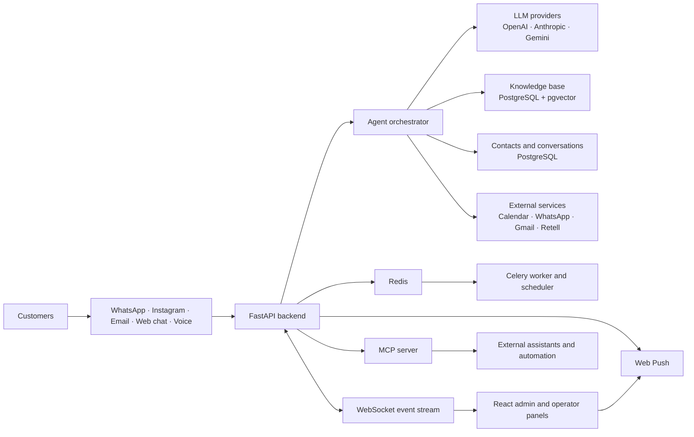

# Multichannel Clinic Support Platform

Customer support application with an AI agent for WhatsApp, Instagram Direct Messages, email, web chat and voice. It includes a built-in knowledge base with RAG, native CRM, a WhatsApp Web-style inbox with human handoff, and outbound messaging. Each deployment belongs to one customer: clone the repository, configure it for that customer, and deploy it on the customer's server.

> **Before production deployment:** read [SECURITY.md](./SECURITY.md). It documents active defenses, the trust model and the mandatory checklist.

## What it does

The platform handles customer questions, service information, audio messages, human handoff and Google Calendar appointment scheduling. It fits any business that serves customers through messaging channels. The agent prompt and knowledge base provide the business-specific behavior.

## Architecture



The backend owns authentication, channel webhooks, agent execution, CRM data, knowledge retrieval, encrypted credentials and audit events. Redis carries queues and transient state. Celery handles background work such as indexing, outbound delivery and scheduled jobs. PostgreSQL stores application data and vector embeddings. The React frontend uses the API and WebSocket stream for the operator inbox. Docker Compose runs the complete stack.

## Stack

- **Backend:** Python 3.12, FastAPI, Celery and Redis
- **Database:** PostgreSQL 16 with pgvector for conversation memory, CRM data and RAG
- **LLMs:** OpenAI, Anthropic or Gemini behind the `LLMProvider` interface; selected from the admin panel
- **Embeddings:** OpenAI `text-embedding-3-small`
- **Audio transcription:** OpenAI Whisper
- **WhatsApp:** YCloud or Meta directly behind `WhatsAppProvider`
- **Other channels:** Instagram Direct Messages, Retell voice, Gmail or SMTP email, and web chat
- **Outbound email:** Resend or SMTP
- **Operator alerts:** Web Push and the live panel event log; no Telegram or Slack integration
- **Frontend:** React and TypeScript with real-time WebSocket inbox
- **Deployment:** Docker and EasyPanel

## Repository structure

| Path | Contents |
|---|---|
| `CLAUDE.md` | Working manual: stack, environment, tests, migrations and conventions. **Start here.** |
| `SECURITY.md` | Active defenses, trust model and pre-production checklist |
| `ARCHITECTURE.md` | System context, runtime responsibilities and message flow diagrams |
| `DEPLOY_EASYPANEL.md` | Installation guide for the customer's server |
| `backend/` | Python API, agent, background tasks and data models |
| `backend/tests/` | Automated pytest suite |
| `backend/app/db/migrations/versions/` | Database migrations |
| `frontend/` | React admin and operator panels |
| `mcp-server/` | MCP server exposing the agent API to external assistants |
| `design/` | Design summary, data model, API contract and screens |
| `deployment/` | Pointer to the deployment guide |
| `scripts/smoke.sh` | Deployment smoke check |
| `.claude/commands/` | Project-specific Claude Code commands |
| `docker-compose.yml` and `.env.desarrollo.example` | Local development |
| `.env.example` | Deployment variables used by EasyPanel |
| `docker-compose.easypanel.yml` | Production stack |

## Quick start: local development

```bash
# 1. Create a local environment file
cp .env.desarrollo.example .env

# 2. Generate required secrets in .env
openssl rand -hex 24                  # -> POSTGRES_PASSWORD
openssl rand -base64 48               # -> JWT_SECRET
python3 -c "from cryptography.fernet import Fernet; print(Fernet.generate_key().decode())"   # -> ENCRYPTION_KEY

# 3. Start the full stack
docker compose up -d

# 4. Check the services after roughly 30 seconds
curl http://localhost:8000/health
# -> {"status":"ok","db":"ok","redis":"ok","worker":"ok","worker_last_seen_seconds":12}
open http://localhost:5173            # -> login panel
```

Use the values configured in `INITIAL_ADMIN_EMAIL` and `INITIAL_ADMIN_PASSWORD` in `.env` to sign in.

Configure real provider credentials at `/admin/connections`, then copy the webhook URLs shown on each channel card into the provider dashboard. Next, open `/admin/agent/agents` and complete the prompts for the two agents created during installation. Their behavior rules are ready, but business-specific values use `[[ RELLENAR: ... ]]` markers. Complete every marker before enabling a channel.

## End-to-end verification

| # | Check | How |
|---|---|---|
| 1 | Clean deployment | `docker compose up` starts every service without errors |
| 2 | Migrations | Tables, `match_chunks`, admin seed, prompt seed and tags are created |
| 3 | Login | Email and password produce a JWT and open the panel |
| 4 | Real-time inbox | Changes in one browser tab appear in a second tab through WebSocket |
| 5 | Knowledge base | Upload PDF, index it, search it and inspect chunks |
| 6 | YCloud webhook | POST a test payload to `/api/v1/webhooks/ycloud` |
| 7 | Agent | A real message receives a tool-using response with RAG and CRM access |
| 8 | Human handoff | `derivar_humano` changes status to `humano` and sends panel/Web Push alerts |
| 9 | Audio | WhatsApp voice message is transcribed and processed |
| 10 | Operator response | Inbox reply reaches the WhatsApp user |
| 11 | 24-hour window | UI blocks messages outside the allowed window |
| 12 | Tests | Install `backend/requirements-dev.txt` and run `pytest -q` from `backend/` |

## Continuous integration

Every GitHub push runs `.github/workflows/ci.yml`: the backend test suite against a real database, migrations in both directions, frontend build and type checks, and Docker builds for the backend, frontend and MCP server. Ruff runs in informational mode because the repository still contains legacy warnings; it reports them without blocking the workflow.

A green workflow does not prove that a deployment is safe by itself. Configure GitHub branch protection and disable EasyPanel auto-deployment as described in [DEPLOY_EASYPANEL.md](./DEPLOY_EASYPANEL.md).

## Working on the code

Open this directory with Claude Code and read `CLAUDE.md`. It contains the folder map, environment setup, test commands, migration workflow and project conventions.

| Command | Use |
|---|---|
| `/session-start` | Rebuild context at the start of a work session |
| `/iterate` | Implement a change from diagnosis through verification |
| `/review` | Run an independent review before accepting a change |

## Deployment model

Each customer receives an isolated instance on its own server. There is no shared central infrastructure.

1. Clone the repository on the customer's VPS.
2. Copy `.env.example` to `.env` and fill in the deployment variables.
3. Deploy with `docker-compose.easypanel.yml`, never the local-development compose file.
4. Upload the customer's documentation to the Knowledge Base through the panel.

`APP_ENV=production` enables startup validation. The production configuration rejects default JWT secrets, example admin credentials and localhost URLs. The development compose file publishes ports without TLS and is unsuitable for an internet-facing deployment.
